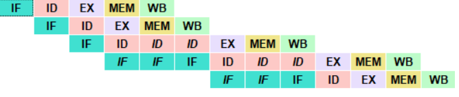

# Práctica 4

## Ejercicio 1

| Registro                             | Nº Instrucción en que se escribe | Nº Instrucción en que se lee     |
|--------------------------------------|----------------------------------|----------------------------------|
| r2                                   | La segunda                       | La tercera                       |
| r3                                   | La tercera                       | La cuarta                        |

## Ejercicio 2

|                                       | Valor|
|---------------------------------------|------|
| Nº de instrucciones ejecutadas        | 5    |
| Nº de ciclos de parada del procesador | 4    |
| Nº de ciclos totales                  | 13   |
| CPI                                   | 1.8  |

## Ejercicio 3

## Ejercicio 5

|                                       | Valor|
|---------------------------------------|------|
| Nº de instrucciones ejecutadas        | 9    |
| Nº de ciclos de parada del procesador | 0    |
| Nº de ciclos totales                  | 13   |
| CPI                                   | 1    |

## Ejercicio 6

Se ha obtenido el mismo tiempo de ejecución puesto que el número de ciclos es el mismo.

## Ejercicio 7 

|                                       | Valor|
|---------------------------------------|------|
| Nº de instrucciones ejecutadas        | 7    |
| Nº de ciclos de parada del procesador | 6    |
| Nº de ciclos totales                  | 17   |
| CPI                                   | 1.86 |

## Ejercicio 9 

|                                       | Valor|
|---------------------------------------|------|
| Nº de instrucciones ejecutadas        | 13   |
| Nº de ciclos de parada del procesador | 0    |
| Nº de ciclos totales                  | 17   |
| CPI                                   | 1    |

## Ejercicio 10

| Registro                             | Nº Instrucción en que se escribe | Nº Instrucción en que se lee     |
|--------------------------------------|----------------------------------|----------------------------------|
| r6                                   | La cuarta                        | La quinta                        |
| r7                                   | La sexta                         | La septima                       |
| r7                                   | La septima                       | La octava                        |
| r8                                   | La octava                        | La novena                        |
| r5                                   | La decimoquinta                  | La decimosexta                   |

## Ejercicio 11

|                                       | Valor|
|---------------------------------------|------|
| Nº de instrucciones ejecutadas        | 125  |
| Nº de ciclos de parada del procesador | 130  |
| Nº de ciclos totales                  | 259  |
| CPI                                   | 2.04 |

## Ejercicio 12

Ciclos de parada por conflicto de datos total: 8 por cada bucle
Ciclos de parada por conflicto de control total: 10 por cada bucle

## Ejercicio 14

|                                       | Valor|
|---------------------------------------|------|
| Nº de instrucciones ejecutadas        | 125  |
| Nº de ciclos de parada del procesador | 127  |
| Nº de ciclos totales                  | 256  |
| CPI                                   | 2    |