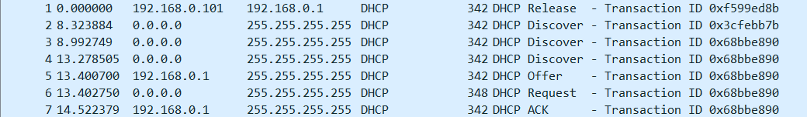

# Práctica 11. Funcionamiento protocolo DHCP.

##  Ejercicio 1.
**Abre una ventana de DOS y ejecuta la orden ipconfig /all. De toda la información que se te muestra, ¿qué parámetros están relacionados con el diálogo DHCP inicial que se ha producido en el arranque del sistema? ¿Cuándo se ha obtenido la concesión de la dirección IP? ¿Cuándo caduca?**

Los campos relacionados con DHCP son
- Dirección física
- DHCP Habilitado
- Configuración automática habilitada
- Concesión obtenida..... : **lunes, 13 de marzo de 2023 4:39:30**
- La concesión expira.... : **martes, 14 de marzo de 2023 11:04:22**
- Servidor DHCP

## Ejercicio 2.
**Ponemos en marcha el analizador de protocolos Wireshark e iniciamos una captura filtrando el tráfico UDP que utilice el puerto 67. A continuación, utilizamos el comando ipconfig /release para liberar la información IP que tiene nuestro ordenador. Ten en cuenta que después de ejecutar este comando tu equipo no tiene acceso a la red y no tendrás acceso al directorio W. Por tanto, si estás en el directorio W deberás cambiar al directorio C ( comando C: ) para poder seguir trabajando. Ejecuta después el comando ipconfig /renew para volver a obtener dirección IP, mientras está en marcha la captura con el Wireshark. Una vez finalizado este proceso paramos la captura.**

## Ejercicio 3.
Con el archivo **Captura1Practica3.pcap**:
**a) En primer lugar, nos centraremos en el primer mensaje DHCP que interviene en el proceso de obtención de la dirección IP: DHCPDISCOVER. Basándote en la información obtenida, ¿qué servicio utiliza DHCP, TCP o UDP? Mirando las direcciones IP origen y destino del datagrama de este primer mensaje, ¿podrías justificar la elección de DHCP por un servicio sin conexión?**

---

Práctica Incompleta