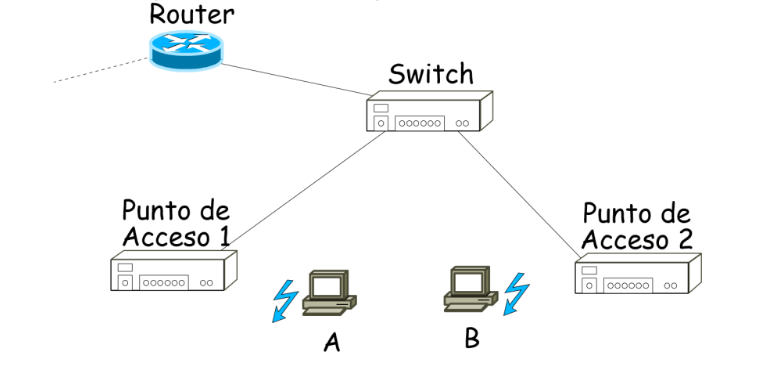

# Práctica 16. WiFi

## Ejercicio 1.

Todas las redes cumplen el estándar IEEE 802.3 o IEEE 802.11. El conmutador (switch) conoce la ubicación de todas las máquinas tras un periodo de funcionamiento. El router está correctamente configurado. La estación A está asociada al punto de acceso 1, mientras que la estación B está asociada al punto de acceso 2. Las cachés ARP de todos los sistemas están vacías, a excepción de las del router, que contiene todas las direcciones físicas necesarias.

Indica, completando una tabla como la siguiente (usa tantas filas como necesites), la secuencia de tramas que se generarán en el envío de un mensaje ICMP de tipo 8 desde el ordenador A al ordenador B (solamente el envío; no hay que describir las tramas que se generarían en la respuesta). Para las direcciones físicas utiliza los valores simbólicos A, B, PA1, PA2, etc. Para las direcciones IP utiliza los valores simbólicos IP A, IP B, IP R, etc.

| Tipo Trama | Dir. 1/Destino | Dir. 2/Origen | Dir. 3 | Origen IP | Destino IP | Función trama | Nodos que reciben la trama |
|--|--|--|--|--|--|--|--|
| 802.11 | PA1 | A | Broadcast | IP A | IP B | Solicitud ARP para MAC de B | PA1 |
| 802.3 | Broadcast | PA1 | N/A | IP A | IP B | Solicitud ARP para MAC de B | R, PA2 |
| 802.11 | Broadcast | PA2 | A | IP A | IP B | Solicitud ARP para MAC de B | B |
| 802.11 | PA2 | B | A | IP B | IP A | Respuesta ARP hacia A | PA2 |
| 802.3 | A | PA2 | N/A | IP B | IP A | Respuesta ARP hacia A | PA1 |
| 802.11 | A | PA1 | B | IP B | IP A | Respuesta ARP hacia A | A |
| 802.11 | PA1 | A | B | IP A | IP B | Mensaje ICMP hacia B | PA1 |
| 802.3 | B | A | N/A | IP A | IP B | Mensaje ICMP hacia B | PA2 |
| 802.11 | B | PA2 | A | IP A | IP B | Mensaje ICMP hacia B | B |

## Ejercicio 2. Wifi2Cable 1

