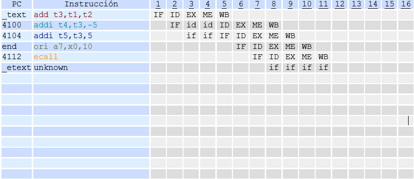
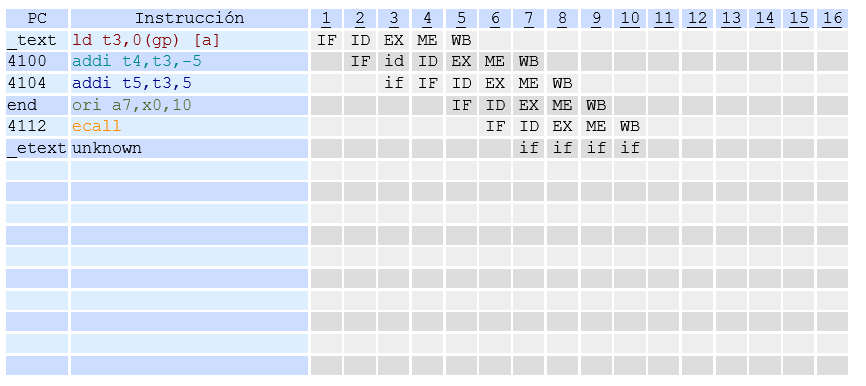
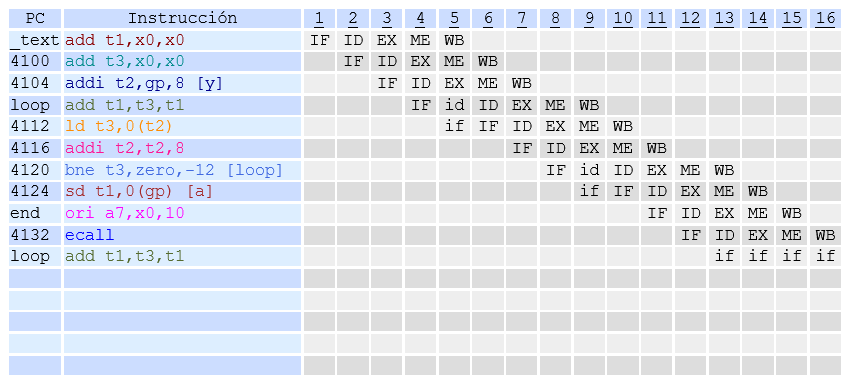

# Práctica 3. Unidad de Instrucción Segmentada II
Durante la sesión se pretende implementar la lógica para resolver los riegos de datos y de control en un simulador de procesador segmentado (RISC V).
Pueden visualizarse los resultados en formato [HTML](https://aic-practicas.netlify.app/p3/).

## Ejercicios a Realizar

### 1. Modificación del simulador. Ciclos de parada
Modificar el simulador del RISC V para detectar y resolver los riesgos de datos in sertando ciclos de parada. En particular, se pretende resolver el riesgo de datos provocado por la secuencia de instrucciones almacenada en el fichero _datos1.s_.

⇒ Dibuja el diagrama instrucciones–tiempo correspondiente a la ejecución de la secuencia de código, insertando los ciclos de parada que sean necesarios.

```
add t3,t1,t2    IF ID EX ME WB  
addi t4,t3,-5      IF id id ID EX ME WB  
addi t5,t3,5          if if IF ID EX ME WB 
```
⇒ Se debe modificar la función que realiza la detección de riesgos de datos en la etapa de decodificación de las instrucciones (función detectar riesgos datos en el archivo riscv int.c), escribiendo el código que activa las señaales de control necesarias (IFstall, IDstall).

```c
switch (solucion_riesgos_datos) {
        case parada:
            /* Riesgo entre EX e ID */
            if (((ID_EX.IR.rd == IF_ID.IR.rs1)) &&
                    rd_valido(ID_EX.IR) && rs1_valido(IF_ID.IR)) {
                IDstall = SI;
                IFstall = SI;
            } else if (((ID_EX.IR.rd == IF_ID.IR.rs2)) &&
                    rd_valido(ID_EX.IR) && rs2_valido(IF_ID.IR)) {
                IDstall = SI;
                IFstall = SI;
            }
            
            /* Riesgo entre MEM e ID */
            if (((EX_MEM.IR.rd == IF_ID.IR.rs1)) &&
                    rd_valido(EX_MEM.IR) && rs1_valido(IF_ID.IR)) {
                IDstall = SI;
                IFstall = SI;
            } else if (((EX_MEM.IR.rd == IF_ID.IR.rs2)) &&
                    rd_valido(EX_MEM.IR) && rs2_valido(IF_ID.IR)) {
                IDstall = SI;
                IFstall = SI;
            } 

            break;
            
        // Otras estrategias....
}
```

⇒ Tras compilar con éxito el simulador, se comprueba su correcto funcionamiento ejecutando:
```bash
$ ./resultados/riscv_ej1 -d p -j -c s3 -f codigo/datos1.s
```



### 2. Modificación del simulador. Cortocircuitos
Modifica el simulador RISC V para detectar y resolver los riesgos de datos aplicando cortocircuitos.

__a) Riesgo de datos__  
No requiere insertar ciclos de parada

⇒ Dibuja el diagrama instrucciones–tiempo correspondiente a la ejecución de la secuencia de código, aplicando los cortocircuitos que sean necesarios.

```
add t3,t1,t2    IF ID EX ME WB  
addi t4,t3,-5      IF ID EX ME WB  
addi t5,t3,5          IF ID EX ME WB
```

⇒ Modifica las funciones que implementan los multiplexores superior (operando fuente1) e inferior (operando fuente2) ubicados a la entrada del operador aritmético-lógico. Estas funciones son mux_ALUsup y mux_ALUinf, respectivamente, y están ubicadas en el fichero _riscv_int.c_.

```c

// MUX ALU SUP

dword mux_ALUsup(dword pc, dword ra, dword mem, dword wb) {
    dword result = 0;
    WBaEXalu_s = NO;
    MEMaEXalu_s = NO;

    switch (ID_EX.IR.codop) {
            _BRANCHES
        case RV32I_JAL:
            result = pc;
            EX.muxALU_sup = 0;
            break;
        case RV32I_AUIPC:
            result = pc ;
            EX.muxALU_sup = 0;
            break;
        default: /* el resto de instrucciones */
            result = ra; /* por defecto */
            EX.muxALU_sup = 3;
            switch (solucion_riesgos_datos) {
                case ninguno:
                case parada:
                    break;
                case cortocircuito:
                    if((EX_MEM.IR.rd == ID_EX.IR.rs1) && (rd_valido(EX_MEM.IR) && rs1_valido(ID_EX.IR))) {
                        result = mem;
                        MEMaEXalu_s = SI;
                        EX.muxALU_sup = 1;
                        write_log_2("corto MEMaEXalu_s", ID_EX.iPC, EX_MEM.iPC, "EX", "MEM");
                        break;
                    }
                    if((MEM_WB.IR.rd == ID_EX.IR.rs1) && (rd_valido(MEM_WB.IR) && rs1_valido(ID_EX.IR))) {
                        result = wb;

                        WBaEXalu_s = SI;
                        EX.muxALU_sup = 2;
                        write_log_2("corto WBaEXalu_s", ID_EX.iPC, MEM_WB.iPC, "EX", "WB");
                    }
                    break;
            }
    }

    fnDebug(NO, "muxALUsup pc %ld ra %ld mem %ld wb %ld result %ld\n", pc, ra, mem, wb, result);
    return (result);
}

// MUX ALU INF

dword mux_ALUinf(dword rb, dword imm, dword mem, dword wb) {

    dword result = 0;

    WBaEXalu_i = NO;
    MEMaEXalu_i = NO;

    switch (ID_EX.IR.tipo) {
        case FormatoR:
            result = rb; /* por defecto */
            EX.muxALU_inf = 0;
            if (solucion_riesgos_datos == cortocircuito) {
              if((EX_MEM.IR.rd == ID_EX.IR.rs2) && (rd_valido(EX_MEM.IR) && rs2_valido(ID_EX.IR))) {
                    result = mem;

                    MEMaEXalu_i = SI;
                    EX.muxALU_inf = 1;
                    write_log_2("corto MEMaEXalu_i", ID_EX.iPC, EX_MEM.iPC, "EX", "MEM");
                    break;
                }
                if((MEM_WB.IR.rd == ID_EX.IR.rs2) && (rd_valido(MEM_WB.IR) && rs2_valido(ID_EX.IR))) {
                    result = wb;

                    WBaEXalu_i = SI;
                    EX.muxALU_inf = 2;
                    write_log_2("corto WBaEXalu_i", ID_EX.iPC, MEM_WB.iPC, "EX", "WB");
                }
                break;
            }
            break;
        case FormatoI:
        case FormatoIshift:
        case FormatoS:
        case FormatoB:
        case FormatoU:
        case FormatoJ:
            result = imm;
            EX.muxALU_inf = 3;
            break;
        default:
            result = rb;
            EX.muxALU_inf = 0;
    }
    fnDebug(NO, "muxALUinf rb %ld imm %ld mem %ld wb %ld result %ld\n", rb, imm, mem, wb, result);
    return (result);
}
```

⇒ Tras compilar con éxito el simulador, se comprueba su correcto funcionamiento ejecutando:
```bash
$ ./resultados/riscv_ej2a -j -d c -c s3 -f codigo/datos1.s
```


__b) Riesgo de datos por carga__  
En este caso, además de activar el cortocircuito correspondiente, se debe insertar un ciclo de parada en la etapa de decodificación (fichero _datos2.s_).

⇒ Dibuja el diagrama instrucciones–tiempo correspondiente a la ejecución de
la secuencia de código, insertando los ciclos de parada y aplicando los cortocircuitos que sean necesarios.

*Ver diagrama adjunto al final del ejercicio, tras la ejecución*

⇒ Ahora debe modificarse la función que realiza la detección de riesgos en la etapa de decodificación de las instrucciones (función *detectar_riesgos_datos* en el fichero
*riscv_int.c*)

```c
void detectar_riesgos_datos(void) {

    switch (solucion_riesgos_datos) {
        case parada:
            /* Riesgo entre EX e ID */
            if (((ID_EX.IR.rd == IF_ID.IR.rs1)) &&
                    rd_valido(ID_EX.IR) && rs1_valido(IF_ID.IR)) {
                IDstall = SI;
                IFstall = SI;
            } else if (((ID_EX.IR.rd == IF_ID.IR.rs2)) &&
                    rd_valido(ID_EX.IR) && rs2_valido(IF_ID.IR)) {
                IDstall = SI;
                IFstall = SI;
            }
            /* Riesgo entre MEM e ID */
            if (((EX_MEM.IR.rd == IF_ID.IR.rs1)) &&
                    rd_valido(EX_MEM.IR) && rs1_valido(IF_ID.IR)) {
                IDstall = SI;
                IFstall = SI;
            } else if (((EX_MEM.IR.rd == IF_ID.IR.rs2)) &&
                    rd_valido(EX_MEM.IR) && rs2_valido(IF_ID.IR)) {
                IDstall = SI;
                IFstall = SI;
            } 
            break;
        case cortocircuito:
              if(es_load(ID_EX.IR)){
                if(((ID_EX.IR.rd == IF_ID.IR.rs1)) && rd_valido(ID_EX.IR) && rs1_valido(IF_ID.IR)){
                    IDstall = SI;
                    IFstall = SI;
                }else if(((ID_EX.IR.rd == IF_ID.IR.rs2)) && rd_valido(ID_EX.IR) && rs2_valido(IF_ID.IR)){
                    IDstall = SI;
                    IFstall = SI;
                }
              }
                        break;
        default:
            break;
    }
}
```

⇒ Tras compilar con éxito el simulador, se comprueba su correcto funcionamiento ejecutando:
```bash
$ ./resultados/riscv_ej2b -j -d c -c s3 -f codigo/datos2.s
```



### 3. Modificación del simulador. *Predict-Not-Taken*

⇒ Para ello, se debe modificar la función que realiza la etapa de búsqueda de las instrucciones (función *fase_busqueda* en el fichero _riscv.c_).
Para probar esta modificación, puede emplearse el código almacenado en el fichero _suma.s_

```c
void fase_busqueda() {

    init_instruc(PC, orden);

    if (en_region(mmem, PC, r_text)) {
        if (esta_alineada_dir_instruc(PC)) {
            IF_IDn.IR = lee_mem_instruc(mmem, PC);
        } else {
            fprintf(stderr, "\nAtención (IF): acceso desalineado al segmento de instrucciones Ciclo=%u PC=%"PRId64"\n",
                    Ciclo + 1, PC);
        }
    } else {
        /*** Excepción en el acceso a la memoria de instrucciones */
    }

    IF_IDn.NPC = PC + 4;

    IF_IDn.iPC = PC;
    IF_IDn.orden = orden;

    SaltoEfectivo = NO;

    fnDebug(NO, "IF. Ciclo %u PC=%ld Instruccion %d\n", Ciclo, PC, IF_IDn.IR.codop);
    switch (solucion_riesgos_control) {
        case ds3:
            if (EX_MEM.cond) {
                SaltoEfectivo = SI;
                PCn = EX_MEM.ALUout;
                            } else {
                PCn = PC + 4;
            }
            break;
        case ds2:
                        break;
        case ds1:
                        break;
        case pnt3:
            
              if (EX_MEM.cond) {
                SaltoEfectivo = SI;
                PCn = EX_MEM.ALUout;
                IFnop = SI;
                IDnop = SI;
                EXnop = SI;
            } else {
                PCn = PC + 4;
            }

            break;
        case pnt2:
                        break;

        case pnt1:
                        break;
        case stall3:
            if (EX_MEM.cond) {
                SaltoEfectivo = SI;
                PCn = EX_MEM.ALUout;
                IFnop = SI;
                write_log("IFnop", EX_MEM.iPC);
                write_log("Salto Efectivo", EX_MEM.iPC);
            } else {
                PCn = PC + 4;
            }
            break;
        case stall2:
                        break;

        case stall1:
                        break;

        default:;
    }
}
```

⇒ Tras compilar con éxito el simulador, se comprueba su correcto funcionamiento ejecutando:
```bash
$ ./resultados/riscv_ej3 -j -d p -c pnt3 -f codigo/suma.s
```


