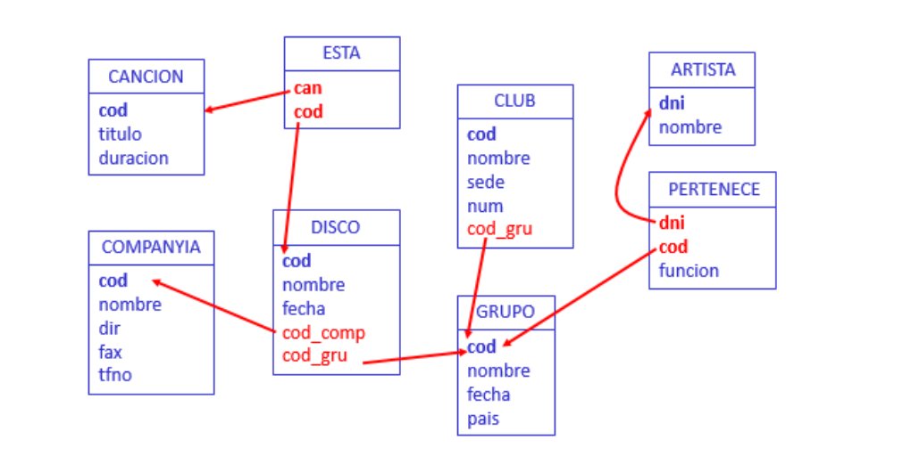

# Práctica 1 (Unidad 2.2)

## 1. Ejercicios sobre la base de datos CINE


### 1.1 Consultas sobre una sola tabla

1. **Obtener ordenados ascendentemente los códigos de los países de donde son los actores**

```sql
SELECT DISTINCT cod_pais
FROM actor
ORDER BY cod_pais;
```

2. **Obtener el código y el título de las películas de año anterior a 1970 que no estén basadas en ningún libro ordenadas por título.**

```sql
SELECT cod_peli, titulo
FROM pelicula
WHERE anyo < 1970 AND cod_lib IS NULL
ORDER BY titulo;
```

3. **Obtener el código y el nombre de los actores cuyo nombre incluye “John”.**

```sql
SELECT cod_act, nombre
FROM actor
WHERE nombre LIKE '%John%'
```

4. **Obtener el código y el título de las películas de más de 120 minutos de la década de los 80.**

```sql
SELECT cod_peli, titulo
FROM pelicula
WHERE duracion > 120 AND anyo BETWEEN 1980 AND 1989
ORDER BY titulo
```

5. **Obtener el código y el título de las películas que estén basadas en algún libro y cuyo director se apellide ‘Pakula’.**

```sql
SELECT cod_peli, titulo
FROM pelicula
WHERE cod_lib is not null and director LIKE '% Pakula%'
```

6. **¿Cuántas películas hay de más de 120 minutos de la década de los 80?**

```sql
SELECT count(*)
FROM pelicula
WHERE duracion > 120 AND anyo BETWEEN 1980 AND 1989
ORDER BY titulo
```

7. **¿Cuántas películas se han clasificado de los géneros de código 'BB5' o 'GG4' o'JH6'.**

```sql
SELECT count(DISTINCT cod_peli)
FROM clasificacion
WHERE cod_gen IN('BB5','GG4','JH6')
```

8. **¿De qué año es el libro más antiguo?**

```sql
SELECT MIN(anyo)
FROM libro_peli
```

9. **¿Cuál es la duración media de las películas del año 1987?**

```sql
SELECT AVG(duracion)
FROM pelicula
WHERE anyo=1987
```

10. **¿Cuántos minutos ocupan todas las películas dirigidas por ‘Steven Spielberg’?**

```sql
SELECT SUM(duracion)
FROM pelicula
WHERE director='Steven Spielberg'
```

### 1.2 Consultas sobre varias tablas

11. **Obtener el código y el título de las películas en las que actúa un actor con el mismo nombre que el director de la película (ordenadas por título).**

```sql
SELECT p.cod_peli, p.titulo
FROM pelicula p, actua act, actor atr
WHERE act.cod_act=atr.cod_act and act.cod_peli=p.cod_peli and p.director=atr.nombre
ORDER BY p.titulo
```

12. **Obtener el código y el título de las películas clasificadas del género de nombre ‘Comedia’ (ordenadas por título)**

```sql
SELECT p.cod_peli, p.titulo
FROM pelicula p, clasificacion c, genero g
WHERE g.nombre='Comedia' and g.cod_gen=c.cod_gen and c.cod_peli=p.cod_peli
ORDER BY p.titulo
```

13. **Obtener el código y el título de las películas basadas en algún libro anterior a 1950.**

```sql
SELECT cod_peli, pelicula.titulo
FROM pelicula, libro_peli l
WHERE pelicula.cod_lib = l.cod_lib AND libro.anyo < 1950
```

14. **Obtener el código y el nombre de los países de los actores que actúan en películas clasificadas del género de nombre ‘Comedia’ (ordenados por nombre).**

```sql
SELECT DISTINCT pa.cod_pais, pa.nombre
FROM pais pa, actor atr, actua act, pelicula pe, clasificacion c, genero g
WHERE g.nombre='Comedia' and g.cod_gen=c.cod_gen and c.cod_peli=act.cod_peli and act.cod_act=atr.cod_act and atr.cod_pais=pa.cod_pais
ORDER BY pa.nombre
```

### 1.3 Consultas con subconsultas

15. **Resolver ejercicios 11, 12, 13, 14 con subconsultas.**

```sql
-- Ejercicio 11
SELECT cod_peli, titulo
FROM pelicula p
WHERE EXISTS (SELECT * 
                FROM actua act
                WHERE act.cod_peli = p.cod_peli
                AND act.cod_act IN (SELECT atr.cod_act
                                    FROM actor atr
                                    WHERE atr.nombre = p.director))
ORDER BY titulo;

-- Ejercicio 12
SELECT cod_peli, titulo
FROM pelicula p 
WHERE cod_peli IN (SELECT c.cod_peli
                    FROM clasificacion c
                    WHERE cod_gen IN (SELECT cod_gen
                                        FROM genero g
                                        WHERE g.nombre = 'Comedia'))
ORDER BY titulo;

-- Ejercicio 13
SELECT cod_peli, titulo
FROM pelicula
WHERE cod_lib IN (SELECT cod_lib
                    FROM LIBRO_PELI l
                    WHERE l.anyo < 1950)
ORDER BY titulo;

-- Ejercicio 14
SELECT cod_pais, nombre
FROM pais
WHERE cod_pais IN (SELECT cod_pais
                    FROM actor
                    WHERE cod_act IN (SELECT cod_act
                                        FROM actua
                                        WHERE cod_peli IN (SELECT cod_peli
                                                            FROM clasificacion
                                                            WHERE cod_gen IN (SELECT cod_gen
                                                                                FROM genero
                                                                                WHERE nombre = 'Comedia'))))
ORDER BY nombre
```

16. **Obtener el código y el nombre de los actores nacidos antes de 1950 que actúan con un papel 'Principal' en alguna película (ordenados por nombre).**
```sql
SELECT cod_act, nombre
FROM actor
WHERE EXTRACT(YEAR FROM fecha_nac) < 1950 AND
    cod_act IN (SELECT cod_act
                FROM actua
                WHERE papel = 'Principal')
ORDER BY nombre
```

17. **Obtener el código, el título y el autor de los libros en los que se ha basado alguna película de la década de los 90 (ordenados por título)**
```sql
SELECT cod_lib, titulo, autor
FROM libro_peli
WHERE cod_lib IN (SELECT cod_lib
                    FROM pelicula
                    WHERE anyo BETWEEN 1990 AND 1999)
ORDER BY titulo
```

18. **Obtener el código, el título y el autor de los libros en los que no se haya basado ninguna película**
```sql
SELECT cod_lib, titulo, autor
FROM libro_peli
WHERE cod_lib NOT IN (SELECT cod_lib
                        FROM pelicula
                        WHERE cod_lib IS NOT NULL)
```

19. **Obtener el nombre del género o géneros a los que pertenecen películas en las que no actúa ningún actor (ordenados por nombre)**
```sql
SELECT nombre
FROM genero
WHERE cod_gen IN (SELECT cod_gen
                    FROM clasificacion
                    WHERE cod_peli IN (SELECT cod_peli
                                        FROM pelicula
                                        WHERE cod_peli NOT IN (SELECT cod_peli FROM actua)))
ORDER BY nombre
```

20. **Obtener el título de los libros en los que se haya basado alguna película en la que no hayan actuado actores del país de nombre ‘USA’ (ordenados por título)**
```sql
SELECT titulo
FROM libro_peli
WHERE cod_lib IN (SELECT cod_lib
                    FROM pelicula
                    WHERE cod_peli NOT IN (SELECT cod_peli
                                            FROM actua
                                            WHERE cod_act IN (SELECT cod_act
                                                                FROM actor
                                                                WHERE cod_pais IN (SELECT cod_pais
                                                                                    FROM pais
                                                                                    WHERE nombre = 'USA'))))
ORDER BY titulo
```

21. **¿Cuántas películas hay clasificadas del género de nombre ‘Comedia’ y en las que sólo aparece un actor con el papel ‘Secundario’?**

```sql
SELECT count(*)
FROM pelicula p
WHERE p.cod_peli IN (SELECT cod_peli
                    FROM clasificacion
                    WHERE cod_gen IN (SELECT cod_gen
                                      FROM genero
                                      WHERE nombre = 'Comedia')) AND (SELECT count(*)
                                                                      FROM actua a
                                                                      WHERE a.cod_peli = p.cod_peli and papel = 'Secundario') = 1
```

22. **Obtener el año de la primera película en la que el actor de nombre ‘Jude Law’ tuvo un papel como ‘Principal’**

```sql
SELECT MIN(p.anyo)
FROM Pelicula p
WHERE p.cod_peli IN (SELECT act.cod_peli
                    FROM Actua act
                    WHERE act.papel = 'Principal' AND act.cod_act IN (SELECT atr.cod_act
                                                                    FROM Actor atr
                                                                    WHERE atr.nombre = 'Jude Law'))
```

23. **Obtener el código y el nombre de actor o actores más viejos.**

```sql
SELECT cod_act, nombre
FROM Actor
WHERE fecha_nac = (SELECT MIN(fecha_nac) FROM Actor)
```

24. **Obtener el código, el nombre y la fecha de nacimiento del actor más viejo nacido en el año 1940**

```sql
SELECT cod_act, nombre, fecha_nac
FROM actor
WHERE fecha_nac = (SELECT MIN(fecha_nac) FROM actor WHERE fecha_nac LIKE '%1940')
```

25. **Obtener el nombre del género (o de los géneros) en los que se ha clasificado la película más larga**

```sql
SELECT nombre 
FROM genero
WHERE cod_gen IN (SELECT cod_gen 
                 FROM clasificacion
                 WHERE cod_peli = (SELECT cod_peli
                                   FROM pelicula
                                   WHERE duracion = (SELECT MAX(duracion) FROM pelicula)))
```

26. **Obtener el código y el título de los libros en los que se han basado películas en las que actúan actores del país de nombre España (ordenados por título)**

```sql
SELECT cod_lib, titulo
FROM libro_peli
WHERE cod_lib IN (SELECT cod_lib
                  FROM pelicula
                  WHERE cod_peli IN (SELECT cod_peli
                                     FROM actua
                                     WHERE cod_act IN (SELECT cod_act 
                                                       FROM actor
                                                       WHERE cod_pais = (SELECT cod_pais 
                                                                         FROM pais
                                                                         WHERE nombre = 'España'))))
ORDER BY titulo
```

27. **Obtener el título de las películas anteriores a 1950 clasificadas en más de un género (ordenadas por título)**

```sql
SELECT p.titulo
FROM Pelicula p
WHERE anyo < 1950 AND p.cod_peli IN (SELECT c1.cod_peli 
                                    FROM Clasificacion c1, Clasificacion c2 
                                    WHERE c1.cod_gen <> c2.cod_gen AND c1.cod_peli = c2.cod_peli)
```

28. **Obtener la cantidad de películas en las que han participado menos de 4 actores**

```sql
SELECT count(*)
FROM Pelicula p
WHERE 4 > (SELECT count(*) FROM Actua a WHERE a.cod_peli = p.cod_peli)
```

29. **Obtener los directores que han dirigido más de 250 minutos entre todas sus películas**

```sql
SELECT DISTINCT p1.director
FROM Pelicula p1
WHERE (250 - p1.duracion)  < (SELECT SUM(p2.duracion) 
                            FROM Pelicula p2 
                            WHERE p1.director = p2.director AND p1.cod_peli <> p2.cod_peli) OR p1.duracion > 250
```

30. **Obtener el año o años en el que nacieron más de 3 actores**

```sql
SELECT DISTINCT EXTRACT(YEAR FROM atr1.fecha_nac)
FROM Actor atr1
WHERE 2 < (SELECT COUNT(atr2.fecha_nac) 
           FROM Actor atr2 
           WHERE EXTRACT(YEAR FROM atr1.fecha_nac) = EXTRACT(YEAR FROM atr2.fecha_nac) and atr1.nombre <> atr2.nombre)
```

31. **Obtener el código y nombre del actor más joven que ha participado en una película clasificada del género de código ‘DD8’**

```sql
SELECT atr.cod_act, atr.nombre
FROM Actor atr
WHERE atr.fecha_nac = (SELECT MIN(atr2.fecha_nac) 
                       FROM Actor atr2 
                       WHERE atr2.cod_act IN (SELECT act.cod_act 
                                               FROM Actua act 
                                               WHERE cod_peli IN (SELECT c.cod_peli 
                                                                   FROM Clasificacion c 
                                                                   WHERE cod_gen = 'DD8')))
```

### 1.4 Consultas universalmente cuantificadas

32. **Obtener el código y el nombre de los países con actores y tales que todos los actores de ese país han nacido en el siglo XX (ordenados por nombre).**
```sql
SELECT *
FROM pais p
WHERE p.cod_pais IN (SELECT a.cod_pais
                        FROM actor a) AND NOT EXISTS (SELECT 1
                                                        FROM actor a1
                                                        WHERE a1.cod_pais = p.cod_pais AND
                                                        EXTRACT(YEAR FROM a1.fecha_nac) NOT BETWEEN 1900 AND 1999)
ORDER BY nombre
```

33. **Obtener el código y el nombre de los actores tales que todos los papeles que han tenido son de ‘Secundario’. Sólo interesan aquellos actores que hayan actuado en alguna película.**

```sql
SELECT ac.cod_act, ac.nombre
FROM actor ac
WHERE ac.cod_act IN (SELECT aa.cod_act
                        FROM actua aa) AND NOT EXISTS (SELECT 1
                                                        FROM actua aa1
                                                        WHERE aa1.cod_act = ac.cod_act AND aa1.papel != 'Secundario')
ORDER BY nombre
```

34. **Obtener el código y el nombre de los actores que han aparecido en todas las películas del director ‘Guy Ritchie’ (sólo si ha dirigido al menos una).**

```sql
SELECT atr.cod_act, atr.nombre
FROM actor atr
WHERE 0 < (SELECT COUNT(*)
            FROM pelicula
            WHERE director = 'Guy Ritchie') AND NOT EXISTS (SELECT 1
                                                            FROM pelicula p
                                                            WHERE p.director = 'Guy Ritchie' AND NOT EXISTS (SELECT 1
                                                                                                              FROM actua act
                                                                                                              WHERE act.cod_act = atr.cod_act AND p.cod_peli = act.cod_peli))
```

35. **Resolver la consulta anterior pero para el director de nombre ‘John Steel’.**

```sql
SELECT atr.cod_act, atr.nombre
FROM actor atr
WHERE 0 < (SELECT COUNT(*)
            FROM pelicula
            WHERE director = 'John Steel') AND NOT EXISTS (SELECT 1
                                                            FROM pelicula p
                                                            WHERE p.director = 'John Steel' AND NOT EXISTS (SELECT 1
                                                                                                              FROM actua act
                                                                                                              WHERE act.cod_act = atr.cod_act AND p.cod_peli = act.cod_peli))
```

36. **Obtener el código y el título de las películas de menos de 100 minutos en las que todos los actores que han actuado son de un mismo país.**

```sql
SELECT p.cod_peli, p.titulo
FROM pelicula p
WHERE p.duracion < 100 AND ((SELECT COUNT(*)
                            FROM actua
                            WHERE cod_peli = p.cod_peli) = 1 OR 1 < (SELECT COUNT(*)
                                                                        FROM actua
                                                                        WHERE cod_peli = p.cod_peli) AND NOT EXISTS (SELECT 1
                                                                                                                        FROM actua act1, actua act2
                                                                                                                        WHERE act1.cod_peli = p.cod_peli AND
                                                                                                                              act2.cod_peli = p.cod_peli AND NOT EXISTS (SELECT 1
                                                                                                                                                                          FROM actor atr1, actor atr2
                                                                                                                                                                          WHERE atr1.cod_act = act1.cod_act AND
                                                                                                                                                                                atr2.cod_act = act2.cod_act AND
                                                                                                                                                                                atr1.cod_pais = atr2.cod_pais)))
```

37. **Obtener el código, el título y el año de las películas en las que haya actuado algún actor si se cumple que todos los actores que han actuado en ella han nacido antes del año 1943 (hasta el 31/12/1942).**

```sql
SELECT p.cod_peli, p.titulo, p.anyo
FROM pelicula p
WHERE 0 < (SELECT COUNT(*)
            FROM actua act
            WHERE act.cod_peli = p.cod_peli) AND NOT EXISTS (SELECT 1
                                                              FROM actua act1
                                                              WHERE p.cod_peli = act1.cod_peli AND NOT EXISTS (SELECT 1
                                                                                                                FROM actor atr
                                                                                                                WHERE atr.cod_act = act1.cod_act
                                                                                                                AND EXTRACT(YEAR FROM atr.fecha_nac) < 1943))
ORDER BY titulo
```

38. **Obtener el código y el nombre de cada país si se cumple que todos sus actores han actuado en al menos una película de más de 120 minutos. (Ordenados por nombre)**

```sql
SELECT pa.cod_pais, pa.nombre
FROM pais pa
WHERE EXISTS (SELECT 1
              FROM actor atr
              WHERE atr.cod_pais = pa.cod_pais) AND NOT EXISTS (SELECT 1
                                                                FROM actor atr1
                                                                WHERE atr1.cod_pais = pa.cod_pais AND NOT EXISTS (SELECT 1
                                                                                                                    FROM actua act, pelicula p
                                                                                                                    WHERE act.cod_peli = p.cod_peli AND
                                                                                                                          p.duracion > 120 AND
                                                                                                                          atr1.cod_act = act.cod_act))
ORDER BY nombre
```
### 1.5 Consultas agrupadas

39. **Obtener el código y el título del libro o libros en que se ha basado más de una película, indicando cuántas películas se han hecho sobre él.**

```sql
SELECT l.cod_lib, l.titulo, COUNT(*) AS CUANTOS
FROM libro_peli l, pelicula p
WHERE l.cod_lib = p.cod_lib
GROUP BY l.cod_lib, l.titulo
HAVING COUNT(*) > 1
```

40. **Obtener para cada género en el que se han clasificado más de 5 películas, el código y el nombre del género indicando la cantidad de películas del mismo y duración media de sus películas. (Ordenados por nombre). (La función ROUND redondea al entero más cercano).**

```sql
SELECT g.cod_gen, g.nombre, COUNT(*), ROUND(AVG(p.duracion))
FROM genero g, pelicula p, clasificacion c
WHERE c.cod_gen = g.cod_gen AND p.cod_peli = c.cod_peli
GROUP BY g.cod_gen, g.nombre
HAVING 5 < COUNT(*)
ORDER BY nombre
```

41. **Obtener el código y el título de las películas de año posterior al 2000 junto con el número de géneros en que están clasificadas, si es que están en alguno. (Ordenadas por título).**

```sql
SELECT p.cod_peli, p.titulo, COUNT(*) AS CUANTOS
FROM pelicula p, clasificacion c
WHERE c.cod_peli = p.cod_peli AND p.anyo > 2000
GROUP BY p.cod_peli, p.titulo
ORDER BY titulo
```

42. **Obtener los directores que tienen la cadena ‘George’ en su nombre y que han dirigido exactamente dos películas.**

```sql
SELECT p.director AS DIRECTOR
FROM pelicula p
WHERE p.director LIKE '%George%'
GROUP BY p.director
HAVING COUNT(*) = 2
```

43. **Obtener para cada película clasificada exactamente en un género y en la que haya actuado algún actor, el código, el título y la cantidad de actores que actúan en ella.**

```sql
SELECT p.cod_peli, p.titulo, COUNT(*) AS N_ACTORES
FROM pelicula p, actua act
WHERE p.cod_peli = act.cod_peli AND p.cod_peli IN (SELECT p1.cod_peli FROM pelicula p1, clasificacion c WHERE p1.cod_peli = c.cod_peli GROUP BY p1.cod_peli HAVING COUNT(*) = 1)
GROUP BY p.cod_peli, p.titulo
SELECT p.cod_peli, p.titulo
FROM pelicula p, actua act, actor atr
WHERE p.duracion < 100 AND p.cod_peli = act.cod_peli AND act.cod_act = atr.cod_act
GROUP BY p.cod_peli, p.titulo
HAVING COUNT(DISTINCT act.cod_pais) = 1
HAVING COUNT(*) > 0
```

44. **Obtener el código y el nombre de todos los países con actores indicando cuántos actores de cada país han actuado en al menos una película de la década de los 60**

```sql
SELECT p.cod_pais, p.nombre, COUNT(*) AS CUANTOS
FROM pais p, actor a
WHERE a.cod_pais = p.cod_pais AND cod_act IN (SELECT cod_act FROM actua WHERE cod_peli IN (SELECT cod_peli FROM pelicula WHERE anyo BETWEEN 1960 AND 1969))
GROUP BY p.cod_pais, p.nombre
```

45. **Obtener el código, el nombre del género en el que hay clasificadas más películas (puede haber más de uno).**

```sql
SELECT g.cod_gen, g.nombre, COUNT(*) AS CUANTAS
FROM genero g, clasificacion c
WHERE g.cod_gen = c.cod_gen
GROUP BY g.cod_gen, g.nombre
HAVING COUNT(*) = (SELECT MAX(COUNT(DISTINCT cod_peli)) FROM genero g2, clasificacion c2 WHERE g2.cod_gen = c2.cod_gen GROUP BY g2.cod_gen, g2.nombre)
```

46. **Obtener el código, el título y el autor del libro en el que se han basado más películas (puede haber más de uno).**
```sql
SELECT l.cod_lib, l.titulo, l.autor
FROM libro_peli l, pelicula p
WHERE l.cod_lib = p.cod_lib
GROUP BY l.cod_lib, l.titulo, l.autor
HAVING COUNT(*) = (SELECT MAX(COUNT(l2.cod_lib)) FROM libro_peli l2, pelicula p2 WHERE l2.cod_lib = p2.cod_lib GROUP BY l2.cod_lib)
```

47. **Obtener el código y el nombre del país que más actores tiene que hayan participado exactamente en 2 películas.**
```sql
SELECT pa.cod_pais, pa.nombre
FROM pais pa, actor atr
WHERE pa.cod_pais = atr.cod_pais AND atr.cod_act IN (SELECT act.cod_act FROM actua act GROUP BY act.cod_act HAVING COUNT(*) = 2)
GROUP BY pa.cod_pais, pa.nombre
HAVING COUNT(*) = (SELECT MAX(COUNT(pa2.cod_pais)) FROM pais pa2, actor atr2 WHERE pa2.cod_pais = atr2.cod_pais AND atr2.cod_act IN (SELECT act2.cod_act FROM actua act2 GROUP BY act2.cod_act HAVING COUNT(*) = 2) GROUP BY pa2.cod_pais)
```

48. **Obtener el año o años en el que nacieron más de 3 actores indicando cuántos nacieron exactamente.**
```sql
SELECT EXTRACT(YEAR FROM fecha_nac), COUNT(*) AS CUANTOS
FROM actor
GROUP BY EXTRACT(YEAR FROM fecha_nac)
HAVING COUNT(*) > 3
```

49. **Obtener el código y el título de las películas de menos de 100 minutos en las que todos los actores que han actuado son de un mismo país.**
```sql
SELECT p.cod_peli, p.titulo
FROM pelicula p, actua act, actor atr
WHERE p.duracion < 100 AND p.cod_peli = act.cod_peli AND act.cod_act = atr.cod_act
GROUP BY p.cod_peli, p.titulo
HAVING COUNT(DISTINCT act.cod_pais) = 1
```

### 1.6 Consultas con concatenación

50. **Obtener para todos los países que hay en la base de datos, el código, el nombre y la cantidad de actores que hay de ese país.**

```sql
SELECT p.cod_pais, p.nombre, COUNT(a.cod_act) AS CUANTOS
FROM pais p LEFT JOIN actor a
ON a.cod_pais = p.cod_pais
GROUP BY p.cod_pais, p.nombre
ORDER BY nombre
```

51. **Obtener el código y el título de todos los libros de la base de datos de año posterior a 1980 junto con la cantidad de películas a que han dado lugar.**

```sql
SELECT l.cod_lib, l.titulo, COUNT(p.cod_peli)
FROM libro_peli l LEFT JOIN pelicula p
ON l.cod_peli = p.cod_peli
WHERE l.anyo > 1980
GROUP BY l.cod_lib, l.titulo
ORDER BY l.titulo
```

52. **Obtener para todos los países que hay en la base de datos, el código, el nombre y la cantidad de actores que hay de ese país que hayan tenido un papel como "Secundario" en alguna película**

```sql
SELECT p.cod_pais, p.nombre, COUNT(DISTINCT atr.cod_act) AS CUANTOS
FROM pais p LEFT JOIN (actor atr JOIN actua act ON atr.cod_act = act.cod_act AND act.papel = 'Secundario')
ON p.cod_pais = atr.cod_pais
GROUP BY p.cod_pais, p.nombre
ORDER BY p.nombre
```

53. **Obtener para cada película que hay en la base de datos que dure más de 140 minutos, el código, el título, la cantidad de géneros en los que está clasificado y la cantidad de actores que han actuado en ella.**

```sql
SELECT p.cod_peli, p.titulo, COUNT(c.cod_gen) AS GEN, COUNT(a.cod_act)
FROM (pelicula p LEFT JOIN clasificacion c ON c.cod_peli = p.cod_peli) LEFT JOIN actua a ON p.cod_peli = a.cod_peli
WHERE p.duracion > 140
GROUP BY p.cod_peli, p.titulo
ORDER BY p.titulo
```

### 1.7 Consultas conjuntistas

54. **Obtener los años, ordenados ascendentemente, que aparecen en la base de datos como año en el que se editó un libro o se filmó una película. Sólo interesan años en los que no aparezca el dígito 9.**

```sql
SELECT DISTINCT anyo
FROM pelicula
WHERE anyo NOT LIKE '%9%'
UNION (SELECT DISTINCT anyo
FROM libro_peli
WHERE anyo NOT LIKE '%9%')
ORDER BY anyo
```
### 1.8 Consultas generales

55. **Obtener el nombre del género (o de los géneros) a los que pertenece la película de duración máxima.**

```sql
SELECT DISTINCT c.cod_gen, g.nombre
FROM clasificacion c, genero g
WHERE c.cod_gen = g.cod_gen AND c.cod_peli IN (SELECT p.cod_peli
                                                FROM pelicula p
                                                WHERE p.duracion = (SELECT MAX(p2.duracion) FROM pelicula p2))
```

56. **Obtener, para cada actor nacido antes de 1948 y que haya actuado en al menos 2 películas en cualquier papel, el código, el nombre y la fecha de nacimiento indicando en cuántas películas ha actuado con el papel de "Principal".**

```sql
SELECT atr.cod_act, atr.nombre, atr.fecha_nac, COUNT(act.cod_peli) AS CUANTOS_PRINCIPAL
FROM actor atr LEFT JOIN actua act ON act.cod_act = atr.cod_act AND act.papel = 'Principal'
WHERE EXTRACT (YEAR FROM atr.fecha_nac) < 1948 AND atr.cod_act IN (SELECT atr1.cod_act
                                                                    FROM actor atr1, actua act1
                                                                    WHERE atr1.cod_act = act1.cod_act
                                                                    GROUP BY atr1.cod_act
                                                                    HAVING COUNT(*) >= 2)
GROUP BY atr.cod_act, atr.nombre, atr.fecha_nac
ORDER BY atr.nombre
```

57. **Obtener el código y el nombre de los actores que sólo han actuado en películas anteriores a 1994.**

```sql
SELECT atr.cod_act, atr.nombre
FROM actor atr
WHERE 0 < (SELECT COUNT(*) FROM actua act1 WHERE act1.cod_act = atr.cod_act) AND NOT EXISTS (SELECT 1
                                                                                              FROM actua act
                                                                                              WHERE atr.cod_act = act.cod_act AND NOT EXISTS (SELECT 1
                                                                                                                                              FROM pelicula p
                                                                                                                                              WHERE p.cod_peli = act.cod_peli AND
                                                                                                                                                    p.anyo >= 1994))
```

## 2. Ejercicios sobre la base de datos MÚSICA



### 2.1 Consultas sobre una sola relación

1. **¿Cuántos discos hay?**

```sql
SELECT COUNT(*) AS DISCOS FROM disco
```

2. **Selecciona el nombre de los grupos que no sean de España**

```sql
SELECT nombre
FROM grupo
WHERE pais != 'España'
```

3. **Obtener el título de las canciones con más de 5 minutos de duración**

```sql
SELECT titulo
FROM cancion
WHERE duracion > 5
```

4. **Obtener la lista de las distintas funciones que se pueden realizar en un grupo**

```sql
SELECT DISTINCT funcion
FROM pertenece
```

5. **Obtener la lista de clubs de fans junto con su tamaño (número de personas). La lista debe estar ordenada de menor a mayor según el tamaño del club.**

```sql
SELECT nombre AS CLUB, num AS TAMANYO
FROM club
ORDER BY num
```

6. **Selecciona el nombre y la sede de los clubes de fans con más de 500 socios**

```sql
SELECT nombre, sede
FROM club
WHERE num > 500
```

### 2.2 Consultas sobre varias relaciones

7. **Obtener el nombre y la sede de cada club de fans de grupos de España así como el nombre del grupo al que admiran**

```sql
SELECT c.nombre, c.sede, g.nombre
FROM club c, grupo g
WHERE c.cod_gru = g.cod AND g.pais = 'España'
```

8. **Obtener el nombre de los artistas que pertenezcan a un grupo de España.**

```sql
SELECT a.nombre
FROM artista a
WHERE a.dni IN (SELECT p.dni FROM pertenece p, grupo g WHERE p.cod = g.cod AND g.pais = 'España')
```

9. **Obtener el nombre de los discos que contienen alguna canción que dure más de 5 minutos.**
```sql
SELECT DISTINCT d.nombre
FROM Disco d, Esta e, Cancion c
WHERE c.duracion > 5 AND c.cod = e.can AND e.cod = d.cod
```

10. **Obtener los nombres de las canciones que dan nombre al disco en el que aparecen.**
```sql
SELECT c.titulo  
FROM  cancion c, esta e, disco d
WHERE c.cod = e.can AND e.cod = d.cod AND c.titulo = d.nombre
```

11. **Obtener los nombres de compañías y direcciones postales de aquellas compañías que han grabado algún disco que empiece por ‘A’.**
```sql
SELECT c.nombre, c.dir
FROM Companyia c, Disco d
WHERE c.cod = d.cod_comp AND d.nombre LIKE 'A%'
```

12. **DNI de los artistas que pertenecen a más de un grupo.**
```sql
SELECT DISTINCT a.dni
FROM Artista a, Pertenece p1, Pertenece p2
WHERE a.dni = p1.dni AND p1.dni = p2.dni AND p1.cod <> p2.cod
```

### 2.3 Consultas con subconsultas

13. **Obtener el nombre de los discos del grupo más viejo.**
```sql
SELECT d.nombre
FROM Disco d
WHERE d.cod_gru IN (SELECT g.cod FROM Grupo g WHERE g.fecha IN (SELECT MIN(fecha) FROM Grupo))
```

14. **Obtener el nombre de los discos grabados por grupos con club de fans con más de 5000 personas.**
```sql
SELECT d.nombre
FROM Disco d
WHERE d.cod_gru IN (SELECT c.cod_gru FROM Club c WHERE c.num > 5000)
```

15. **Obtener el nombre de los clubes con mayor número de fans indicando ese número.**
```sql
SELECT nombre, num
FROM club  
WHERE num = (SELECT MAX(num) FROM club)
```

16. **Obtener el título de las canciones de mayor duración indicando la duración.**
```sql
SELECT c1.titulo, c1.duracion
FROM Cancion c1
WHERE c1.duracion = (SELECT MAX(c2.duracion) FROM Cancion c2)
```

### 2.4 Consultas con cuantificación universal

17. **Obtener el nombre de las compañías discográficas que no han trabajado con grupos españoles.**
```sql
SELECT c.nombre
FROM Companyia c
WHERE NOT EXISTS (SELECT * FROM Disco d WHERE d.cod_comp = c.cod AND EXISTS (SELECT * FROM Grupo g WHERE g.pais = 'España' AND d.cod_gru = g.cod))
```

18. **Obtener el nombre de las compañías discográficas que sólo han trabajado con grupos españoles.**
```sql
SELECT c.nombre
FROM Companyia c
WHERE EXISTS (SELECT * FROM Disco d WHERE d.cod_comp = c.cod AND NOT EXISTS (SELECT * FROM Grupo g WHERE g.pais <> 'España' AND d.cod_gru = g.cod))
```

19. **Obtener el nombre y la dirección de aquellas compañías discográficas que han grabado todos los discos de algún grupo.**
```sql
SELECT c.nombre, c.dir
FROM Companyia c
WHERE EXISTS (SELECT * FROM Disco d WHERE c.cod = d.cod_comp
AND NOT EXISTS (SELECT * FROM Disco d1 WHERE c.cod <> d1.cod_comp AND d1.cod_gru = d.cod_gru))
```

### 2.5 Consultas agrupadas

20. **Obtener el nombre de los grupos que sean de España y la suma de sus fans.**
```sql
SELECT g.nombre, SUM(c.num)
FROM Grupo g, Club c
WHERE g.cod = c.cod_gru AND g.pais = 'España'
GROUP BY g.nombre;
```

21. **Obtener para cada grupo con más de dos componentes el nombre y el número de componentes del grupo.**
```sql
SELECT g.nombre, COUNT(p.dni)
FROM Grupo g, Pertenece p
WHERE g.cod = p.cod 
GROUP BY g.nombre
HAVING COUNT(p.dni) > 2;
```

22. **Obtener el número de discos de cada grupo.**
```sql
SELECT g.nombre, COUNT(d.cod)
FROM Grupo g, Disco d
WHERE g.cod = d.cod_gru
GROUP BY g.nombre;
```

23. **Obtener el número de canciones que ha grabado cada compañía discográfica y su dirección.**
```sql
SELECT c.nombre, COUNT(e.can), c.dir
FROM Companyia c LEFT JOIN (Disco d JOIN Esta e ON d.cod = e.cod) ON c.cod = d.cod_comp
GROUP BY c.nombre, c.dir
ORDER BY c.nombre;
```

### 2.6 Consultas generales

24. **Obtener los nombre de los artistas de grupos con clubes de fans de más de 500 personas y que el grupo sea de Inglaterra.**
```sql
SELECT DISTINCT a.nombre
FROM Artista a, Pertenece p, Grupo g, Club c
WHERE a.dni = p.dni AND p.cod = g.cod AND g.cod = c.cod_gru AND c.num > 500 AND g.pais = 'Inglaterra'
ORDER BY a.nombre;
```

25. **Obtener el título de las canciones de todos los discos del grupo U2.**
```sql
SELECT DISTINCT c.titulo
FROM Grupo G, Disco D, Esta e, Cancion c
WHERE g.cod = d.cod_gru AND d.cod = e.cod AND e.can = c.cod AND g.nombre = 'U2'
ORDER BY c.titulo;
```

26. **El dúo dinámico por fin se jubila; para sustituirles se pretende hacer una selección sobre todos los pares de artistas de grupos españoles distintos tales que el primero sea voz y el segundo guitarra. Obtener dicha selección.**
```sql
SELECT a1.nombre, a2.nombre
FROM Artista a1, Artista a2, Pertenece p1, Pertenece p2, Grupo g1, Grupo g2 
WHERE     p1.cod <> p2.cod 
      AND a1.dni = p1.dni 
      AND p1.funcion = 'voz' 
      AND a2.dni = p2.dni 
      AND p2.funcion = 'guitarra' 
      AND p1.cod = g1.cod 
      AND p2.cod = g2.cod 
      AND g1.pais = 'España'
      AND g2.pais = 'España';
```

28. **Obtener el título de la canción de mayor duración si es única.**
```sql
SELECT C.titulo
FROM Cancion c
WHERE c.duracion = (SELECT MAX(duracion) 
                    FROM Cancion) 
      AND NOT EXISTS (SELECT * 
                      FROM Cancion c1
                      WHERE c.duracion = c1.duracion AND c.cod <> c1.cod);
```

29. **Obtener el décimo (debe haber sólo 9 por encima de él) club con mayor número de fans indicando ese número.**
```sql
SELECT c1.nombre, c1.num
FROM Club c1
WHERE 10 = (SELECT COUNT(c2.cod) FROM Club c2 WHERE c2.num >= c1.num);
```

30. **Obtener el nombre de los artistas que tengan la función de bajo en un único grupo y que además éste tenga más de dos miembros.**
```sql
SELECT a.nombre
FROM Artista a, Pertenece p1
WHERE    a.dni = p1.dni 
     AND p1.funcion = 'bajo' 
     AND NOT EXISTS (SELECT * 
                       FROM Pertenece p2 
                     WHERE    p1.dni = p2.dni 
                          AND p1.cod <> p2.cod 
                          AND p2.funcion = 'bajo')
     AND p1.cod IN (SELECT p.cod 
                    FROM Pertenece p 
                    GROUP BY p.cod 
                    HAVING COUNT(p.dni) > 2);
```

31. **¿Cuál es la compañía discográfica que más canciones ha grabado?**
```sql
SELECT c.nombre, COUNT(DISTINCT e.can)
FROM Companyia c, Disco d, Esta e
WHERE c.cod = d.cod_comp AND d.cod = e.cod 
GROUP BY c.nombre
HAVING COUNT(DISTINCT e.can) = (SELECT MAX(COUNT (DISTINCT e.can)) 
                                FROM Companyia c, Disco d, Esta e 
                                WHERE c.cod = d.cod_comp AND d.cod = e.cod 
                                GROUP BY c.cod);
```
