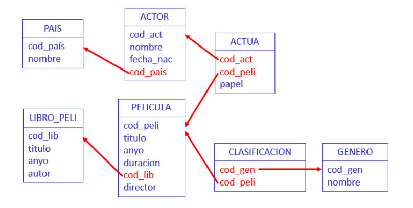

# Práctica 1 (Unidad 2.2)

## 1. Ejercicios sobre la base de datos CINE



## 1.1 Consultas sobre una sola tabla

1. **Obtener ordenados ascendentemente los códigos de los países de donde son los actores**

```sql
SELECT DISTINCT cod_pais
FROM actor
ORDER BY cod_pais;
```

2. **Obtener el código y el título de las películas de año anterior a 1970 que no estén basadas en ningún libro ordenadas por título.**

```sql
SELECT cod_peli, titulo
FROM pelicula
WHERE anyo < 1970 AND cod_lib IS NULL
ORDER BY titulo;
```

3. **Obtener el código y el nombre de los actores cuyo nombre incluye “John”.**

```sql
SELECT cod_act, nombre
FROM actor
WHERE nombre LIKE '%John%'
```

4. **Obtener el código y el título de las películas de más de 120 minutos de la década de los 80.**

```sql
SELECT cod_peli, titulo
FROM pelicula
WHERE duracion > 120 AND anyo BETWEEN 1980 AND 1989
ORDER BY titulo
```

5. **Obtener el código y el título de las películas que estén basadas en algún libro y cuyo director se apellide ‘Pakula’.**

```sql
SELECT cod_peli, titulo
FROM pelicula
WHERE cod_lib is not null and director LIKE '% Pakula%'
```

6. **¿Cuántas películas hay de más de 120 minutos de la década de los 80?**

```sql
SELECT count(*)
FROM pelicula
WHERE duracion > 120 AND anyo BETWEEN 1980 AND 1989
ORDER BY titulo
```

7. **¿Cuántas películas se han clasificado de los géneros de código 'BB5' o 'GG4' o'JH6'.**

```sql
SELECT count(DISTINCT cod_peli)
FROM clasificacion
WHERE cod_gen IN('BB5','GG4','JH6')
```

8. **¿De qué año es el libro más antiguo?**

```sql
SELECT MIN(anyo)
FROM libro_peli
```

9. **¿Cuál es la duración media de las películas del año 1987?**

```sql
SELECT AVG(duracion)
FROM pelicula
WHERE anyo=1987
```

10. **¿Cuántos minutos ocupan todas las películas dirigidas por ‘Steven Spielberg’?**

```sql
SELECT SUM(duracion)
FROM pelicula
WHERE director='Steven Spielberg'
```

## 1.2 Consultas sobre varias tablas

11. **Obtener el código y el título de las películas en las que actúa un actor con el mismo nombre que el director de la película (ordenadas por título).**

```sql
SELECT p.cod_peli, p.titulo
FROM pelicula p, actua act, actor atr
WHERE act.cod_act=atr.cod_act and act.cod_peli=p.cod_peli and p.director=atr.nombre
ORDER BY p.titulo
```

12. **Obtener el código y el título de las películas clasificadas del género de nombre ‘Comedia’ (ordenadas por título)**

```sql
SELECT p.cod_peli, p.titulo
FROM pelicula p, clasificacion c, genero g
WHERE g.nombre='Comedia' and g.cod_gen=c.cod_gen and c.cod_peli=p.cod_peli
ORDER BY p.titulo
```

13. **Obtener el código y el título de las películas basadas en algún libro anterior a 1950.**

```sql
SELECT cod_peli, pelicula.titulo
FROM pelicula, libro_peli l
WHERE pelicula.cod_lib = l.cod_lib AND libro.anyo < 1950
```

14. **Obtener el código y el nombre de los países de los actores que actúan en películas clasificadas del género de nombre ‘Comedia’ (ordenados por nombre).**

```sql
SELECT DISTINCT pa.cod_pais, pa.nombre
FROM pais pa, actor atr, actua act, pelicula pe, clasificacion c, genero g
WHERE g.nombre='Comedia' and g.cod_gen=c.cod_gen and c.cod_peli=act.cod_peli and act.cod_act=atr.cod_act and atr.cod_pais=pa.cod_pais
ORDER BY pa.nombre
```

## 1.3 Consultas con subconsultas

15. **Resolver ejercicios 11, 12, 13, 14 con subconsultas.**

```sql
-- Ejercicio 11
SELECT cod_peli, titulo
FROM pelicula p
WHERE EXISTS (SELECT * 
                FROM actua act
                WHERE act.cod_peli = p.cod_peli
                AND act.cod_act IN (SELECT atr.cod_act
                                    FROM actor atr
                                    WHERE atr.nombre = p.director))
ORDER BY titulo;

-- Ejercicio 12
SELECT cod_peli, titulo
FROM pelicula p 
WHERE cod_peli IN (SELECT c.cod_peli
                    FROM clasificacion c
                    WHERE cod_gen IN (SELECT cod_gen
                                        FROM genero g
                                        WHERE g.nombre = 'Comedia'))
ORDER BY titulo;

-- Ejercicio 13
SELECT cod_peli, titulo
FROM pelicula
WHERE cod_lib IN (SELECT cod_lib
                    FROM LIBRO_PELI l
                    WHERE l.anyo < 1950)
ORDER BY titulo;

-- Ejercicio 14
SELECT cod_pais, nombre
FROM pais
WHERE cod_pais IN (SELECT cod_pais
                    FROM actor
                    WHERE cod_act IN (SELECT cod_act
                                        FROM actua
                                        WHERE cod_peli IN (SELECT cod_peli
                                                            FROM clasificacion
                                                            WHERE cod_gen IN (SELECT cod_gen
                                                                                FROM genero
                                                                                WHERE nombre = 'Comedia'))))
ORDER BY nombre
```

16. **Obtener el código y el nombre de los actores nacidos antes de 1950 que actúan con un papel 'Principal' en alguna película (ordenados por nombre).**
```sql
SELECT cod_act, nombre
FROM actor
WHERE EXTRACT(YEAR FROM fecha_nac) < 1950 AND
    cod_act IN (SELECT cod_act
                FROM actua
                WHERE papel = 'Principal')
ORDER BY nombre
```

17. **Obtener el código, el título y el autor de los libros en los que se ha basado alguna película de la década de los 90 (ordenados por título)**
```sql
SELECT cod_lib, titulo, autor
FROM libro_peli
WHERE cod_lib IN (SELECT cod_lib
                    FROM pelicula
                    WHERE anyo BETWEEN 1990 AND 1999)
ORDER BY titulo
```

18. **Obtener el código, el título y el autor de los libros en los que no se haya basado ninguna película**
```sql
SELECT cod_lib, titulo, autor
FROM libro_peli
WHERE cod_lib NOT IN (SELECT cod_lib
                        FROM pelicula
                        WHERE cod_lib IS NOT NULL)
```

19. **Obtener el nombre del género o géneros a los que pertenecen películas en las que no actúa ningún actor (ordenados por nombre)**
```sql
SELECT nombre
FROM genero
WHERE cod_gen IN (SELECT cod_gen
                    FROM clasificacion
                    WHERE cod_peli IN (SELECT cod_peli
                                        FROM pelicula
                                        WHERE cod_peli NOT IN (SELECT cod_peli FROM actua)))
ORDER BY nombre
```

20. **Obtener el título de los libros en los que se haya basado alguna película en la que no hayan actuado actores del país de nombre ‘USA’ (ordenados por título)**
```sql
SELECT titulo
FROM libro_peli
WHERE cod_lib IN (SELECT cod_lib
                    FROM pelicula
                    WHERE cod_peli NOT IN (SELECT cod_peli
                                            FROM actua
                                            WHERE cod_act IN (SELECT cod_act
                                                                FROM actor
                                                                WHERE cod_pais IN (SELECT cod_pais
                                                                                    FROM pais
                                                                                    WHERE nombre = 'USA'))))
ORDER BY titulo
```

21. **¿Cuántas películas hay clasificadas del género de nombre ‘Comedia’ y en las que sólo aparece un actor con el papel ‘Secundario’?**

```sql
SELECT count(*)
FROM pelicula p
WHERE p.cod_peli IN (SELECT cod_peli
                    FROM clasificacion
                    WHERE cod_gen IN (SELECT cod_gen
                                      FROM genero
                                      WHERE nombre = 'Comedia')) AND (SELECT count(*)
                                                                      FROM actua a
                                                                      WHERE a.cod_peli = p.cod_peli and papel = 'Secundario') = 1
```

22. **Obtener el año de la primera película en la que el actor de nombre ‘Jude Law’ tuvo un papel como ‘Principal’**

```sql
SELECT MIN(p.anyo)
FROM Pelicula p
WHERE p.cod_peli IN (SELECT act.cod_peli
                    FROM Actua act
                    WHERE act.papel = 'Principal' AND act.cod_act IN (SELECT atr.cod_act
                                                                    FROM Actor atr
                                                                    WHERE atr.nombre = 'Jude Law'))
```

23. **Obtener el código y el nombre de actor o actores más viejos.**

```sql
SELECT cod_act, nombre
FROM Actor
WHERE fecha_nac = (SELECT MIN(fecha_nac) FROM Actor)
```

24. **Obtener el código, el nombre y la fecha de nacimiento del actor más viejo nacido en el año 1940**

```sql
SELECT cod_act, nombre, fecha_nac
FROM actor
WHERE fecha_nac = (SELECT MIN(fecha_nac) FROM actor WHERE fecha_nac LIKE '%1940')
```

25. **Obtener el nombre del género (o de los géneros) en los que se ha clasificado la película más larga**

```sql
SELECT nombre 
FROM genero
WHERE cod_gen IN (SELECT cod_gen 
                 FROM clasificacion
                 WHERE cod_peli = (SELECT cod_peli
                                   FROM pelicula
                                   WHERE duracion = (SELECT MAX(duracion) FROM pelicula)))
```

26. **Obtener el código y el título de los libros en los que se han basado películas en las que actúan actores del país de nombre España (ordenados por título)**

```sql
SELECT cod_lib, titulo
FROM libro_peli
WHERE cod_lib IN (SELECT cod_lib
                  FROM pelicula
                  WHERE cod_peli IN (SELECT cod_peli
                                     FROM actua
                                     WHERE cod_act IN (SELECT cod_act 
                                                       FROM actor
                                                       WHERE cod_pais = (SELECT cod_pais 
                                                                         FROM pais
                                                                         WHERE nombre = 'España'))))
ORDER BY titulo
```

27. **Obtener el título de las películas anteriores a 1950 clasificadas en más de un género (ordenadas por título)**

```sql
SELECT p.titulo
FROM Pelicula p
WHERE anyo < 1950 AND p.cod_peli IN (SELECT c1.cod_peli 
                                    FROM Clasificacion c1, Clasificacion c2 
                                    WHERE c1.cod_gen <> c2.cod_gen AND c1.cod_peli = c2.cod_peli)
```

28. **Obtener la cantidad de películas en las que han participado menos de 4 actores**

```sql
SELECT count(*)
FROM Pelicula p
WHERE 4 > (SELECT count(*) FROM Actua a WHERE a.cod_peli = p.cod_peli)
```

29. **Obtener los directores que han dirigido más de 250 minutos entre todas sus películas**

```sql
SELECT DISTINCT p1.director
FROM Pelicula p1
WHERE (250 - p1.duracion)  < (SELECT SUM(p2.duracion) 
                            FROM Pelicula p2 
                            WHERE p1.director = p2.director AND p1.cod_peli <> p2.cod_peli) OR p1.duracion > 250
```

30. **Obtener el año o años en el que nacieron más de 3 actores**

```sql
SELECT DISTINCT EXTRACT(YEAR FROM atr1.fecha_nac)
FROM Actor atr1
WHERE 2 < (SELECT COUNT(atr2.fecha_nac) 
           FROM Actor atr2 
           WHERE EXTRACT(YEAR FROM atr1.fecha_nac) = EXTRACT(YEAR FROM atr2.fecha_nac) and atr1.nombre <> atr2.nombre)
```

31. **Obtener el código y nombre del actor más joven que ha participado en una película clasificada del género de código ‘DD8’**

```sql
SELECT atr.cod_act, atr.nombre
FROM Actor atr
WHERE atr.fecha_nac = (SELECT MIN(atr2.fecha_nac) 
                       FROM Actor atr2 
                       WHERE atr2.cod_act IN (SELECT act.cod_act 
                                               FROM Actua act 
                                               WHERE cod_peli IN (SELECT c.cod_peli 
                                                                   FROM Clasificacion c 
                                                                   WHERE cod_gen = 'DD8')))
```

## 1.4 Consultas universalmente cuantificadas

32. **Obtener el código y el nombre de los países con actores y tales que todos los actores de ese país han nacido en el siglo XX (ordenados por nombre).**
```sql
SELECT *
FROM pais p
WHERE p.cod_pais IN (SELECT a.cod_pais
                        FROM actor a) AND NOT EXISTS (SELECT 1
                                                        FROM actor a1
                                                        WHERE a1.cod_pais = p.cod_pais AND
                                                        EXTRACT(YEAR FROM a1.fecha_nac) NOT BETWEEN 1900 AND 1999)
ORDER BY nombre
```

33. **Obtener el código y el nombre de los actores tales que todos los papeles que han tenido son de ‘Secundario’. Sólo interesan aquellos actores que hayan actuado en alguna película.**

```sql
SELECT ac.cod_act, ac.nombre
FROM actor ac
WHERE ac.cod_act IN (SELECT aa.cod_act
                        FROM actua aa) AND NOT EXISTS (SELECT 1
                                                        FROM actua aa1
                                                        WHERE aa1.cod_act = ac.cod_act AND aa1.papel != 'Secundario')
ORDER BY nombre
```

34. **Obtener el código y el nombre de los actores que han aparecido en todas las películas del director ‘Guy Ritchie’ (sólo si ha dirigido al menos una).**

```sql
SELECT atr.cod_act, atr.nombre
FROM actor atr
WHERE 0 < (SELECT COUNT(*)
            FROM pelicula
            WHERE director = 'Guy Ritchie') AND NOT EXISTS (SELECT 1
                                                            FROM pelicula p
                                                            WHERE p.director = 'Guy Ritchie' AND NOT EXISTS (SELECT 1
                                                                                                              FROM actua act
                                                                                                              WHERE act.cod_act = atr.cod_act AND p.cod_peli = act.cod_peli))
```

35. **Resolver la consulta anterior pero para el director de nombre ‘John Steel’.**

```sql
SELECT atr.cod_act, atr.nombre
FROM actor atr
WHERE 0 < (SELECT COUNT(*)
            FROM pelicula
            WHERE director = 'John Steel') AND NOT EXISTS (SELECT 1
                                                            FROM pelicula p
                                                            WHERE p.director = 'John Steel' AND NOT EXISTS (SELECT 1
                                                                                                              FROM actua act
                                                                                                              WHERE act.cod_act = atr.cod_act AND p.cod_peli = act.cod_peli))
```

36. **Obtener el código y el título de las películas de menos de 100 minutos en las que todos los actores que han actuado son de un mismo país.**

```sql
SELECT p.cod_peli, p.titulo
FROM pelicula p
WHERE p.duracion < 100 AND ((SELECT COUNT(*)
                            FROM actua
                            WHERE cod_peli = p.cod_peli) = 1 OR 1 < (SELECT COUNT(*)
                                                                        FROM actua
                                                                        WHERE cod_peli = p.cod_peli) AND NOT EXISTS (SELECT 1
                                                                                                                        FROM actua act1, actua act2
                                                                                                                        WHERE act1.cod_peli = p.cod_peli AND
                                                                                                                              act2.cod_peli = p.cod_peli AND NOT EXISTS (SELECT 1
                                                                                                                                                                          FROM actor atr1, actor atr2
                                                                                                                                                                          WHERE atr1.cod_act = act1.cod_act AND
                                                                                                                                                                                atr2.cod_act = act2.cod_act AND
                                                                                                                                                                                atr1.cod_pais = atr2.cod_pais)))
```

37. **Obtener el código, el título y el año de las películas en las que haya actuado algún actor si se cumple que todos los actores que han actuado en ella han nacido antes del año 1943 (hasta el 31/12/1942).**

```sql
SELECT p.cod_peli, p.titulo, p.anyo
FROM pelicula p
WHERE 0 < (SELECT COUNT(*)
            FROM actua act
            WHERE act.cod_peli = p.cod_peli) AND NOT EXISTS (SELECT 1
                                                              FROM actua act1
                                                              WHERE p.cod_peli = act1.cod_peli AND NOT EXISTS (SELECT 1
                                                                                                                FROM actor atr
                                                                                                                WHERE atr.cod_act = act1.cod_act
                                                                                                                AND EXTRACT(YEAR FROM atr.fecha_nac) < 1943))
ORDER BY titulo
```

> [!WARNING]
> Práctica incompleta
