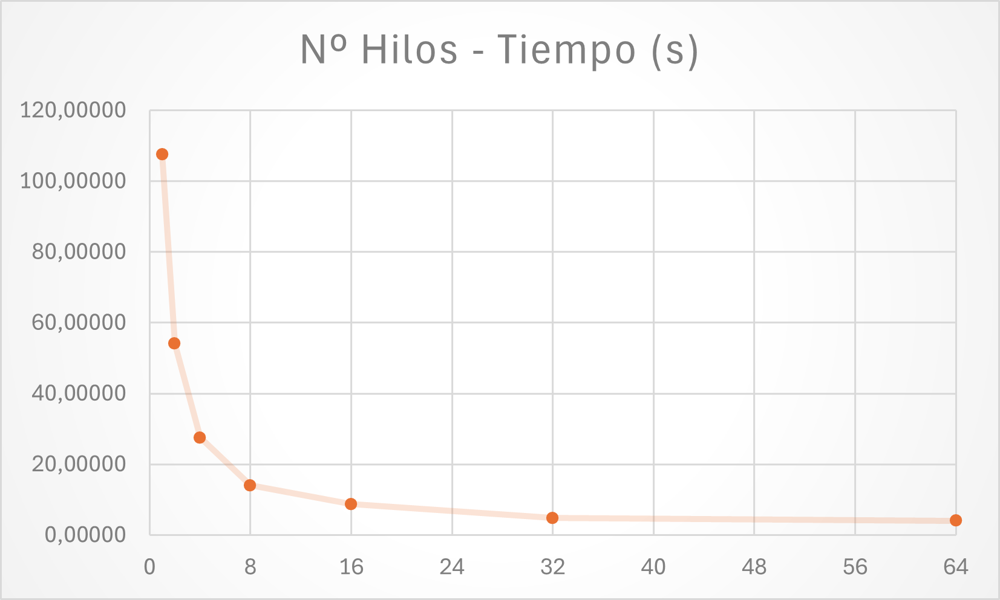
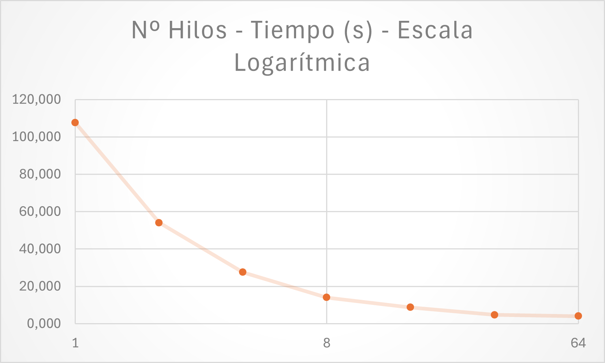
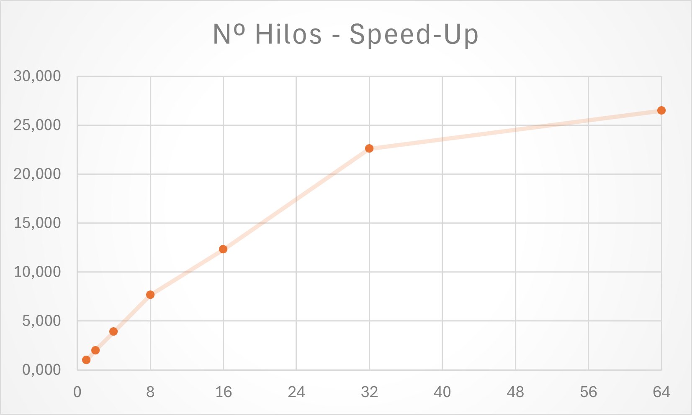
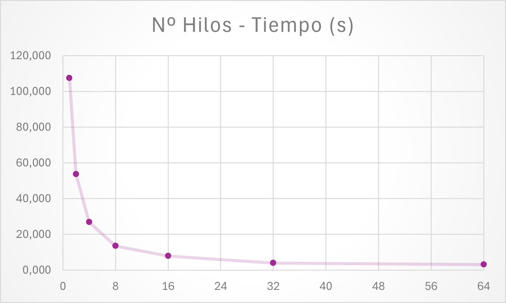
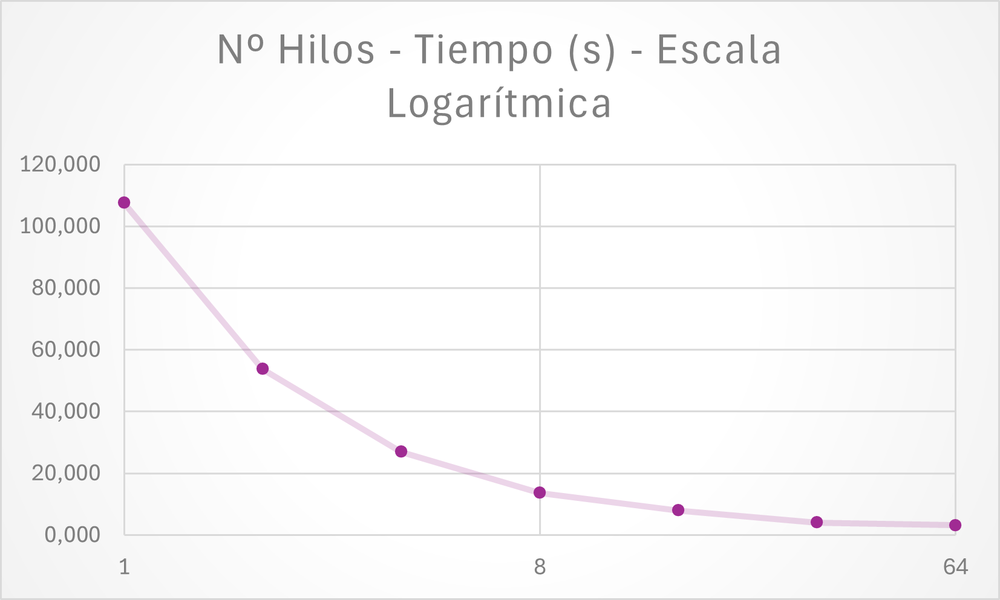
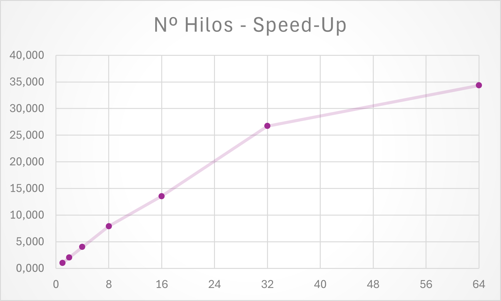

# Práctica 2. Comparación de Código Genético

## 1. Introducción
En esta práctica se trabajará con un programa que simula procesar un conjunto de muestras de códigos genéticos (generadas aleatoriamente), con el objetivo de paralelizarlo usando _OpenMP_ y comparar las prestaciones obtenidas.

## 2. Programa Objeto de Estudio
El programa `codes.c` trabaja con un array de muestras generadas aleatoriamente que se representan como cadenas de texto con las letras A, G, C y T. Las muestras se comparan para obtener:
- Diferencia mínima de cada muestra (array `mindiff`)
- Diferencia máxima de cada muestra (array `maxdiff`)
- Número de muestras próximas a la analizada (array `nclose`)

La función principal es `process`, que calcula diferencias entre las muestras usando la Distancia de Levenshtein.

### Uso del programa:

```bash
$ ./codes <num_muestras> <longitud_muestras>
```

## 3. Desarrollo de Versiones Paralelas con _OpenMP_
Para el desarollo de esta práctica, se deben crear dos versiones paralelas del programa centrando la paralelización en la función `process`, que es la más costosa en términos de tiempo de ejecución. Las versiones deben mostrar:
- El tiempo de ejecución.
- El número de hilos utilizados.

```c
// Al final de la función main()
double t1, t2;
t1 = omp_get_wtime();
process(ns, samples, delta, mindiff, maxdiff, nclose);
t2 = omp_get_wtime();

printf("El tiempo total de ejecución con %d hilos ha sido de %f segundos \n",omp_get_max_threads(), t2-t1);
```

Se justificarán las decisiones tomadas con respecto a las variables compartidas, privadas y el uso de directivas de sincronización para evitar condiciones de carrera.

### Ejercicio 1: Paralelización del bucle interno
**Crear una versión paralela de codes.c (llamada `codesp1.c`) paralelizando el bucle interno con _OpenMP_. Comparar los resultados con la versión secuencial.**

```c
for (i=0; i<ns; i++) {
    nclose_i = 0;
    mind_i = MAX_LEN+1;
    maxd_i = 0;

    #pragma omp parallel for private(d) reduction(max: maxd_i) reduction(min: mind_i) reduction(+: nclose_i)
    for (j=i+1; j<ns; j++) {
        d = difference(samples[i],samples[j]);
        // Update min and max differences for sample i
        if ( d < mind_i ) mind_i = d;
        if ( d > maxd_i ) maxd_i = d;
        // Update min and max differences for sample j
        if ( d < mindiff[j] ) mindiff[j] = d;
        if ( d > maxdiff[j] ) maxdiff[j] = d;
        // Update close counts for samples i and j
        if ( d < delta ) {
            nclose_i++;
            nclose[j]++;
        }
    }

    // Update close counts for sample i
    nclose[i] += nclose_i;
    // Update min and max differences for sample i
    if ( mind_i < mindiff[i] ) mindiff[i] = mind_i;
    if ( maxd_i > maxdiff[i] ) maxdiff[i] = maxd_i;
}
```
Para la paralelización de este bucle se ha necesitado privatizar la variable d, puesto que cada hilo necesitará disponer de un espacio reservado para almacenar la diferencia entre los códigos analizados en su iteración. De igual manera, se necesita aplicar tres reducciones, para la diferencia máxima (`max`), la diferencia mínima (`min`) y para el número de muestras próximas (`+`).

### Ejercicio 2: Paralelización del bucle externo
**Crear una versión paralela (llamada `codesp2.c`) paralelizando el bucle externo. Verificar la corrección del programa utilizando comparaciones con la versión secuencial.**
```c
#pragma omp parallel for private(j, d, nclose_i, mind_i, maxd_i)
for (i=0; i<ns; i++) {
    nclose_i = 0;
    mind_i = MAX_LEN+1;
    maxd_i = 0;
    for (j=i+1; j<ns; j++) {
        d = difference(samples[i],samples[j]);
        // Update min and max differences for sample i
        if ( d < mind_i ) mind_i = d;
        if ( d > maxd_i ) maxd_i = d;
        // Update min and max differences for sample j
        if ( d < mindiff[j] )
            #pragma omp critical
            if (d < mindiff[j]) mindiff[j] = d;

        if ( d > maxdiff[j] )
            #pragma omp critical
            if (d > maxdiff[j]) maxdiff[j] = d;

        // Update close counts for samples i and j
        if ( d < delta ) {
            nclose_i++;
            #pragma omp atomic
            nclose[j]++;
        }
    }
    // Update close counts for sample i
    nclose[i] += nclose_i;
    // Update min and max differences for sample i
    if ( mind_i < mindiff[i] ) mindiff[i] = mind_i;
    if ( maxd_i > maxdiff[i] ) maxdiff[i] = maxd_i;
}
```
En este segundo caso no ha sido necesario aplicar ninguna reducción, pues cada hilo trabajará con un valor para `i` diferente, y calculará las diferencias mínimas y máximas de las muestras que le corresponden de manera individual. Es por eso que se ha necesitado privatizar las variables `nclose_i`, `mind_i` y `maxd_i`, para que cada hilo pueda trabajar con su propia copia de estas variables.

Adicionalmente, y a diferencia de la versión anterior, se ha necesitado aplicar varias directicas de sincronización `critical` y `atomic` para actualizar las variables `mindiff`, `maxdiff` y `nclose`, puesto que varios hilos podrían intentar acceder a la misma posición de memoria al mismo tiempo (únicamente dentro del bucle interno, con el valor de `j`), lo que podría provocar condiciones de carrera.

## 4. Estudio de Prestaciones
Para esta sección se usará el sistema de colas del cluster `kahan` para medir el tiempo de ejecución. Se ejecutará el programa con los valores por defecto (200 muestras de tamaño 900), para que el tiempo de ejecución sea considerable.

### Ejercicio 3: Evaluación de la planificación
**Comparar distintas planificaciones de _OpenMP_ para las dos versiones del programa usando 32 hilos.**

Cabe destacar que se han modificado los programas añadiendo la cláusula `schedule` en la directiva `parallel for` para poder especificar la planificación en tiempo de ejecución.

Antes de nada se comprueba el tiempo del programa secuencial, que puede conseguirse lanzándolo con un solo hilo del clúster `kahan`, obteniendose un resultado de `107.542062` segundos.

#### Versión 1. Paralelización del bucle interno (`codesp1.c`)

En primer lugar, ejecutamos los programas en el sistema de colas del clúster `kahan` con las diferentes planificaciones:

- Planificación **estática**: Cada hilo recibe un bloque de iteraciones consecutivas (_chunk_ = 0).

```bash
#!/bin/bash
#SBATCH --nodes=1
#SBATCH --time=10:00
#SBATCH --partition=cpa
OMP_NUM_THREADS=32 OMP_SCHEDULE=static ./codesp1
```

- Planificación estática con asignación **Round Robin**: Las iteraciones se asignan cíclicamente a los hilos (bloques de una iteración, _chunk_ = 1).

```bash
#!/bin/bash
#SBATCH --nodes=1
#SBATCH --time=10:00
#SBATCH --partition=cpa
OMP_NUM_THREADS=32 OMP_SCHEDULE="static,1" ./codesp1
```

- Planificación **dinámica**: Las iteraciones se asignan dinámicamente (bloques de 1 iteración, _chunk_ = 1).

```bash
#!/bin/bash
#SBATCH --nodes=1
#SBATCH --time=10:00
#SBATCH --partition=cpa
OMP_NUM_THREADS=32 OMP_SCHEDULE=dynamic ./codesp1
```

Obteniedo la siguiente tabla comparativa de resultados:

| Planificación | Tiempo (s) |
|---------------|------------|
| Estática      |  4.760892  |
| Round Robin   |  5.509122  |
| Dinámica      |  4.970272  |

Puede observarse que en este caso no exiten diferencias significativas en el tiempo de ejecución entre las distintas planificaciones, siendo la planificación estática la que ha obtenido en este caso el mejor resultado. Tal y como está paralelizado el programa, todas las planificaciones ofrecen un reparto de las iteraciones similar. Esto se debe a que al paralelizar el bucle interno, las iteraciones tiene un coste prácticamente idéntico, pues recorren el mismo número de muestras.

#### Versión 2. Paralelización del bucle externo (`codesp2.c`)

De igual manera, se ejecutan los programas en el sistema de colas del clúster `kahan` con las diferentes planificaciones:

- Planificación estática: Cada hilo recibe un bloque de iteraciones consecutivas (_chunk_ = 0).

```bash
#!/bin/bash
#SBATCH --nodes=1
#SBATCH --time=10:00
#SBATCH --partition=cpa
OMP_NUM_THREADS=32 OMP_SCHEDULE=static ./codesp2
```

- Planificación round-robin: Las iteraciones se asignan cíclicamente (Round Robin, _chunk_ = 1).

```bash
#!/bin/bash
#SBATCH --nodes=1
#SBATCH --time=10:00
#SBATCH --partition=cpa
OMP_NUM_THREADS=32 OMP_SCHEDULE="static,1" ./codesp2
```

- Planificación dinámica: Las iteraciones se asignan dinámicamente (_chunk_ = 1).

```bash
#!/bin/bash
#SBATCH --nodes=1
#SBATCH --time=10:00
#SBATCH --partition=cpa
OMP_NUM_THREADS=32 OMP_SCHEDULE=dynamic ./codesp2
```

Tabla comparativa de resultados:

| Planificación | Tiempo (s) |
|---------------|------------|
| Estática      |  8.206357  |
| Round Robin   |  4.563631  |
| Dinámica      |  4.025051  |

En este caso, las planificaciones Round Robin y Dinámica han sido las que mejores resultados han dado. Esto se debe a que aprovechan mejor los recursos del clúster. Al paralelizar el bucle externo, las iteraciones tienen cada vez un coste menor, pues analizan menos muestras a medida que el iterador `i` avanza. De esta manera, con planificaicón estática de _chunk_ = 0, los últimos hilos realizarán tareas mucho más cortas, quedando inactivos al terminar, desaprovechando así recursos.
### Ejercicio 4: Variación del número de hilos
Ejecutar ambas versiones paralelas variando el número de hilos (usando potencias de 2), eligiendo la mejor planificación obtenida del ejercicio anterior. Comparar resultados mediante tablas y gráficos (tiempo, speed-up, eficiencia) y justificar el número máximo de hilos elegido.

#### Versión 1. Paralelización del bucle interno (`codesp1.c` - Planificación `estática`)
En este caso la mejor planificación ha sido la estática, no obstante, es indiferente cuál usar, pues todas aprovechan los recursos del mismo modo.

| Nº Hilos | Tiempo (s) | Speed-up | Eficiencia |
|----------|------------|----------|------------|
| 1        |  107.542062|  1.000000| 1.000000 |
| 2        |   54.026698 | 1.990535 | 0.995267  |
| 4        |   27.524425 | 3.907150|  0.976787  |
| 8        |   14.060403 | 7.648576 |  0.956072  |
| 16       |   8.730817 | 12.317525 |  0.769845  |
| 32       |  4.760892  |22.588637|  0.705894  |
| 64       |  4.062112  |26.474420|  0.413662  |





#### Versión 2. Paralelización del bucle externo (`codesp2.c` - Planificación `dinámica`)
En este caso la mejor planificación ha sido la dinámica, pues aprovecha mejor los recursos del clúster (también es válida la planificación rotativa de _chunk_ = 1).

| Nº Hilos | Tiempo (s) | Speed-up | Eficiencia |
|----------|------------|----------|------------|
| 1        |  107.542062|  1.000000| 1.000000 |
| 2        |   53.733556 | 2.001394 | 1.000697  |
| 4        |   26.911704 | 3.996107 |  0.999026  |
| 8        |   13.591953 | 7.912186 |  0.989023  |
| 16       |   7.934760 | 13.553284 |  0.847080  |
| 32       |  4.025051  |26.718186|  0.834943  |
| 64       |  3.130517  |34.352812|  0.536762  |





---

Como puede observarse, y aunque se hace evidente la mejora de rendimiento con la segunda versión de paralelización (y la planificación adecuada), ambas variantes experimentan efectos idénticos al modificar el número de hilos en su ejecución.

A mayor número de hilos, menor es el tiempo de ejecución. No obstante, también se produce un estancamiento del speed-up (caída de eficiencia) que se hace notar cada vez más conforme aunmenta el número de hilos. Cabe destacar que la caída de eficiencia es más suave en la versión 2, lo que la hace ligeramente más eficiente que la primera.

Se exponen a continuación los tres principales motivos que pueden explicar este comportamiento:

1. **Sobrecarga de paralelismo:**

    Al aumentar el número de hilos, la sobrecarga en la gestión de threads (como la sincronización y la comunicación entre ellos) se incrementa. En este código, las regiones paralelas usan #pragma omp parallel for con reducciones y variables privadas, lo que introduce costes adicionales para coordinar los hilos.
    En sistemas con un número fijo de núcleos físicos, añadir más hilos puede implicar un aumento en el tiempo de cambio de contexto (context switching).

2. **Ley de Amdahl:**

    El speed-up teórico está limitado por la porción del programa que no se puede paralelizar (el código secuencial), aunque se incrementen los hilos.

3. **Reducción de tamaño del trabajo por hilo:**

    Al dividir el trabajo entre un mayor número de hilos, cada hilo tiene menos trabajo, lo que puede provocar que el coste de inicialización y gestión del hilo sea significativo en relación con la cantidad de trabajo útil realizado.

---

Sabiendo esto, puede aproximarse el número óptimo de hilos para la ejecución de estos programas. En este caso, 32 hilos. A partir de este número, la eficiencia comienzan a disminuir y el speed-up no crece de manera proporcional al número de hilos, lo que indica que el coste de la gestión de los hilos supera los beneficios de la paralelización.

Por lo tanto, **para este programa y este _hardware_, `32 hilos` es (aproximadamente) el punto en el que mejor se aprovechan los recursos disponibles.**

En cuanto al número máximo de hilos para las pruebas de este apartado, se ha elegido 64 por ser el máximo número de hilos que se pueden lanzar en un nodo del clúster `kahan`.

## 5. Ejercicio Adicional
### Ejercicio 5: Contabilización de diferencias calculadas
Modificar la versión `codesp2.c` para que:
- Cada hilo imprima su número de identificación y el número de diferencias calculadas.
- Máximo número de diferencias calculadas por un hilo.
- Mínimo número de diferencias calculadas por un hilo.

El programa final se llamará `codesp3.c`.

---

Será necesario almacenar en un array de tamaño dinámico el número de diferencias calculadas por cada hilo.

```c
// Declaración global del array
int *thread_calculated_diffs;

// Reserva de memoria en tiempo de ejecución dentro de main()
thread_calculated_diffs = (int *)malloc(omp_get_max_threads() * sizeof(int));

// Inicialización a 0 de las posiciones del array (también dentro de main())
for (int i = 0; i < omp_get_max_threads(); i++) {
    thread_calculated_diffs[i] = 0;
}
```

Además, dentro del bucle interno, se incrementará el contador de diferencias calculadas por cada hilo.
```c
for (j=i+1; j<ns; j++) {
  d = difference(samples[i],samples[j]);
  thread_calculated_diffs[omp_get_thread_num()]++;
  // ...
}
```

Finalmente, se imprimirán los resultados al final de la ejecución del programa.
```c
// En main() después de process()

int max_thread = 0;
int min_thread = INT_MAX;
#pragma omp parallel reduction(max:max_thread) reduction(min:min_thread)
{
    int n = thread_calculated_diffs[omp_get_thread_num()];
    max_thread = n;
    min_thread = n;

    printf("Thread %d: %d differences between samples\n", omp_get_thread_num(), n);
}

printf("Maximum number of differences computed by a single thread: %d\n", max_thread);
printf("Minimum number of differences computed by a single thread: %d\n\n", min_thread);
```

---

Si se ejecuta `codesp3.c` con planificación estática de _chunk_ = 0, se aprecia con claridad el problema mencionado en el ejercicio 3, en el que los últimos hilos realizan tareas mucho más cortas que los primeros.

## **6. Conclusión**

En esta práctica se ha demostrado cómo la paralelización con *OpenMP* puede mejorar significativamente el rendimiento de un programa secuencial intensivo en cómputo. Se diseñaron y analizaron dos versiones paralelas del programa, enfocándose en la paralelización del bucle interno y del bucle externo. Además, se evaluaron distintas estrategias de planificación y configuraciones de hilos.

Los resultados muestran que:

- La versión que paraleliza el bucle externo (`codesp2.c`) ofrece un mejor rendimiento general y una mayor escalabilidad en comparación con la paralelización del bucle interno.
- La planificación dinámica es más eficiente para la paralelización del bucle externo, debido a la distribución desigual del trabajo entre iteraciones.
- La eficiencia disminuye con el aumento del número de hilos debido a la sobrecarga de gestión y las limitaciones inherentes de paralelismo (Ley de Amdahl).
- El número óptimo de hilos para este problema en el *hardware* disponible es de 32, más allá del cual el *speed-up* se estabiliza y la eficiencia cae significativamente.

En conclusión, la elección de la estrategia de paralelización y planificación resulta crucial para maximizar las prestaciones de un programa paralelo. Esta práctica destaca la importancia de analizar el comportamiento del código en función de las características del *hardware* y las limitaciones del modelo de paralelismo empleado.
